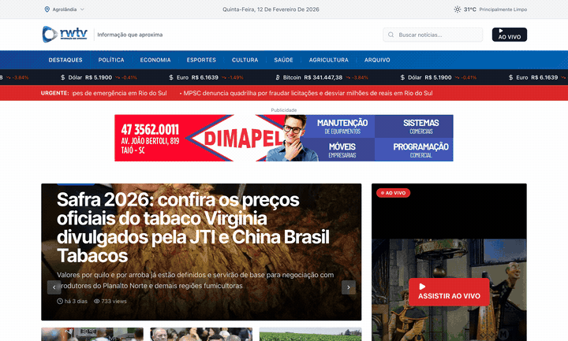

  

  O maior portal de notícias do <b>Alto Vale do Itajaí</b> e <b>Planalto Norte</b> de Santa Catarina.
   
  Notícias por geolocalização, transmissão ao vivo 24h, cotações e publicidade regional.

  <a href="https://rwtv.com.br"><b>rwtv.com.br</b></a> •
  <a href="https://rwtv.com.br/ao-vivo"><b>Ao Vivo</b></a> •
  <a href="https://rwtv.com.br/categoria/politica"><b>Política</b></a> •
  <a href="https://rwtv.com.br/anuncie"><b>Anuncie</b></a>

  
  
  
  

---

  

---

## Por que existe

A RWTV nasceu como o principal veículo de comunicação do Alto Vale do Itajaí, cobrindo **41 cidades** entre o Alto Vale e o Planalto Norte catarinense. O portal precisava ir além de um blog de notícias — precisava ser uma plataforma completa com:

- **Geolocalização real**: o leitor de Taió vê notícias de Taió primeiro. O de Papanduva vê as de Papanduva.
- **Transmissão ao vivo 24h**: streaming integrado direto na home, sem sair do portal.
- **Publicidade regional**: anunciantes compram espaço por cidade e categoria — um açougue de Agrolândia não aparece pra quem é de Blumenau.

O site foi construído do zero com Next.js 14 + Sanity CMS, com um **sistema de publicidade proprietário** e **SDK de tracking** da NineTwo integrado.

---

## Screenshots (telas reais)

### Home — hero com carrossel de destaques + streaming ao vivo + cotações

### Página de categoria — 138 notícias de Política com sidebar de mais lidas e categorias

### Leitura de artigo — imagem, autor, views, categorias relacionadas

### Ao Vivo — streaming JMV com player integrado

### Anuncie Conosco — página de vendas do sistema de publicidade

### Home completa (scroll)

---

## O que eu construí

| Feature | Detalhe |
|---------|---------|
| **Geolocalização de notícias** | 41 cidades mapeadas via Sanity; artigos ordenados por proximidade do leitor |
| **Streaming ao vivo** | Player JMV Stream na home com indicador "AO VIVO" pulsante |
| **Sistema de publicidade** | Banners segmentados por cidade e categoria, gerenciados via CMS, com métricas de impressão |
| **Ticker de cotações** | Dólar, Euro e Bitcoin em tempo real no header |
| **Previsão do tempo** | Dados climáticos por cidade na sidebar |
| **Vídeos do YouTube** | Seção de vídeos em destaque integrada com o canal oficial |
| **Newsletter** | Captura de e-mail direto no portal |
| **Categorias editoriais** | Política, Economia, Esportes, Cultura, Saúde, Agricultura, Segurança, Incêndio |
| **Ranking "Em Alta"** | Top 5 notícias mais lidas por categoria |
| **NineTwo Tracking** | SDK de analytics proprietário + GTM integrado |
| **SEO** | Sitemap dinâmico, meta tags por artigo, Open Graph |
| **Service Worker** | Cache offline e performance |

---

## Stack

| Camada | Tecnologia |
|--------|------------|
| Frontend | Next.js 14 (App Router), React, Tailwind CSS |
| CMS | Sanity (artigos, categorias, banners, configurações editoriais) |
| Streaming | JMV Stream (ao vivo 24h) |
| APIs externas | Cotações financeiras, previsão do tempo, geolocalização |
| Analytics | NineTwo Tracking SDK, GTM, Google Analytics |
| Deploy | Vercel |

---

## Crédito

**João Vitor Moitinho Silva** — arquitetura, desenvolvimento full-stack, sistema de publicidade e deploy.

---

## Licença

**Todos os direitos reservados.**
Este repositório é software proprietário. Uso, cópia, modificação ou redistribuição só com autorização expressa.

Veja: [LICENSE](LICENSE)
